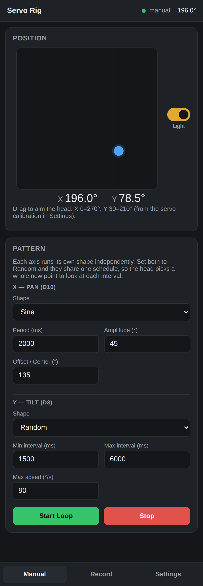
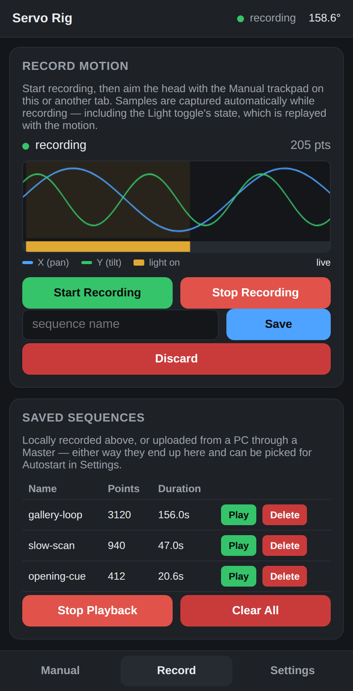
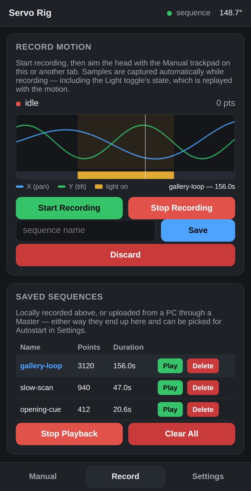
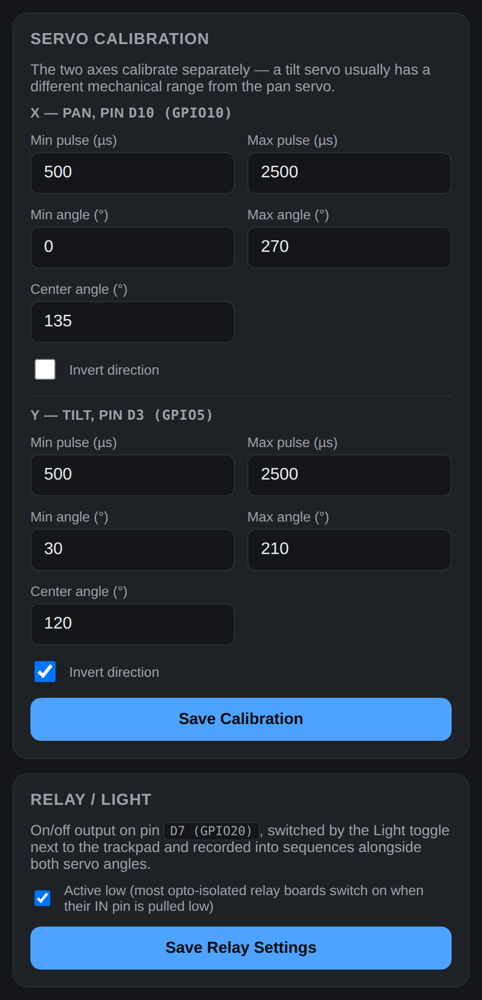
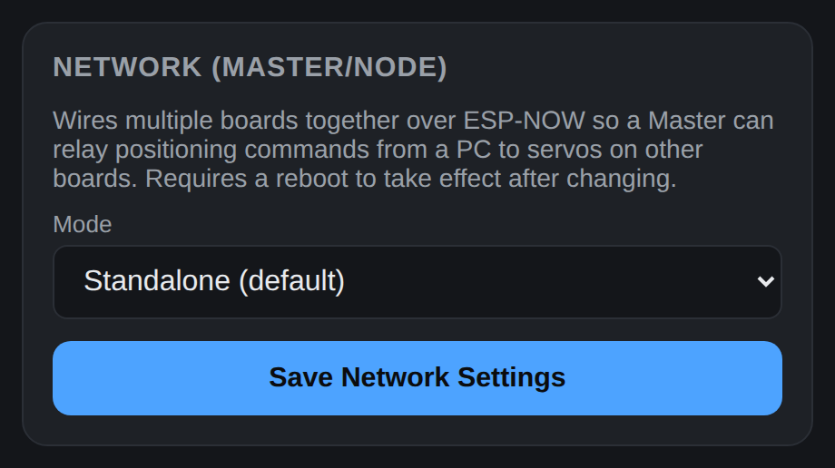
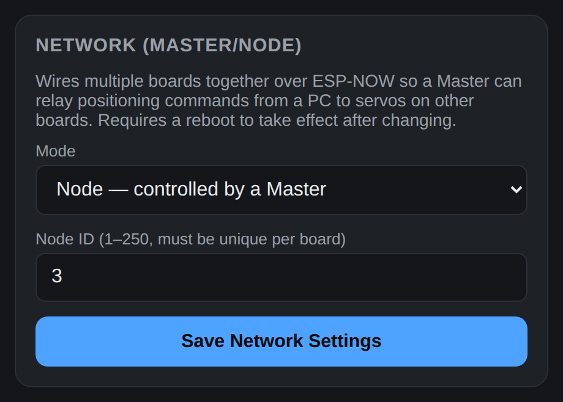
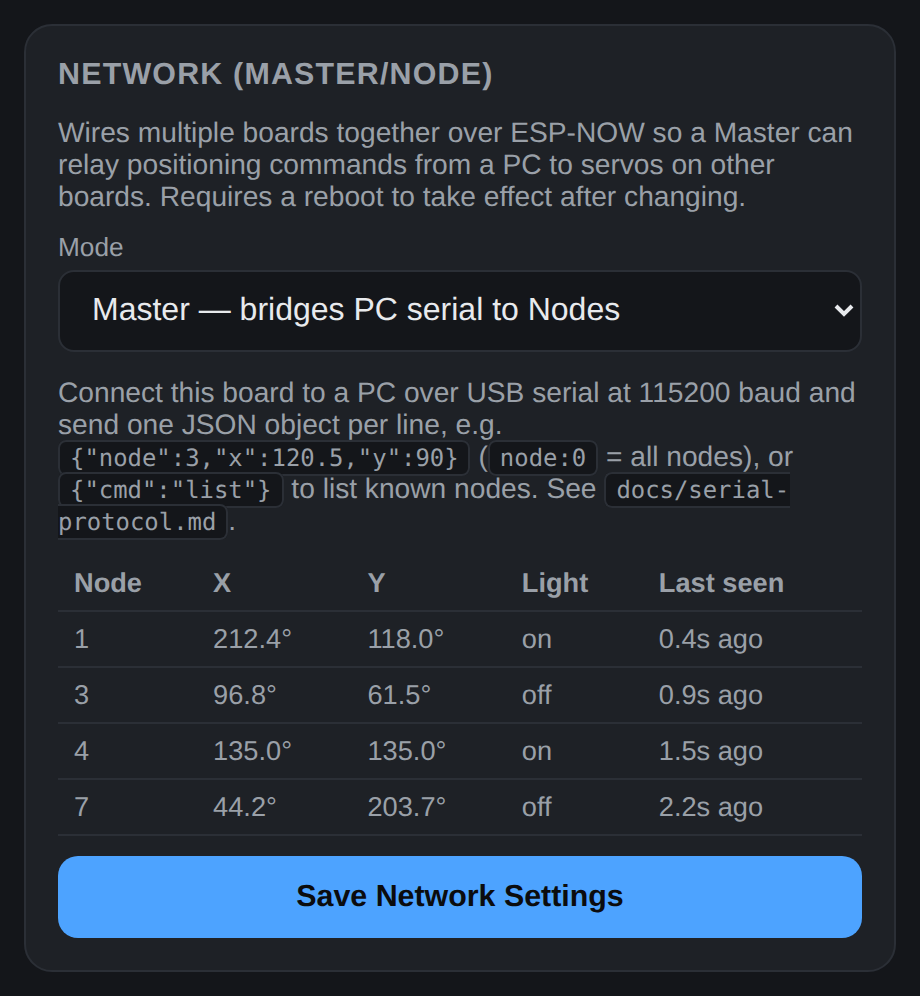
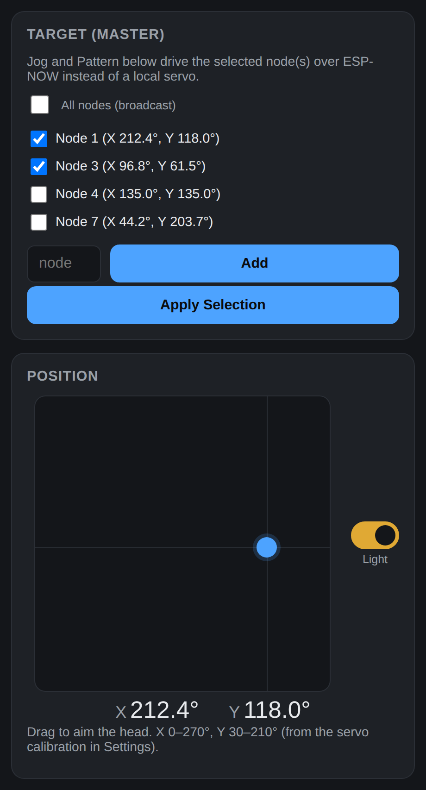
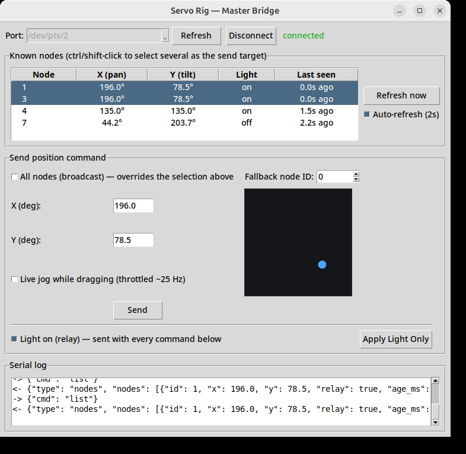
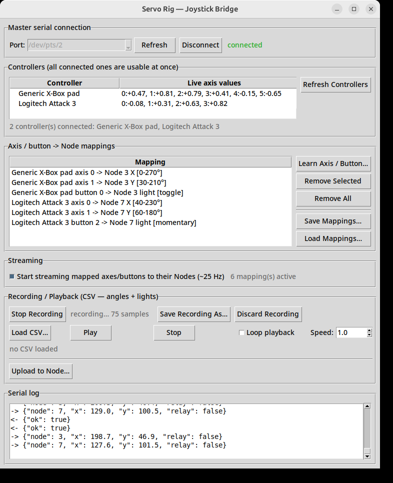

# Servo Motion Controller (XIAO ESP32C3 / ESP32S3)

A self-contained servo motion sequencer for a Seeed XIAO ESP32C3 **or**
ESP32S3, powered over USB-C. On boot it creates its own WiFi access point and
hosts a mobile-first web app (open the AP's IP in a phone browser, WLED-style)
for:

- Live manual aiming of a **pan/tilt head** — two servos, X (pan) on D10 and
  Y (tilt) on D3 — with a square XY trackpad whose extents follow each axis's
  own calibrated travel (270° out of the box, 180° if that's how you set that
  servo up).
- A relay output on pin **D7** for a light, switched by a toggle beside the
  trackpad.
- Parametric motion patterns — sine, square, triangle, sawtooth, trapezoid —
  each with adjustable period/amplitude/offset (and duty or rise/hold/fall
  ratios where relevant), looped continuously. **Each axis runs its own
  shape**, so the head can sweep in pan while nodding slowly in tilt.
- A **random** pattern: new target angles picked inside that axis's calibrated
  range at randomly-drawn intervals between two limits you set. Every move is
  speed-limited and eased in/out rather than jumped, so the servo tracks it
  smoothly instead of slamming from one position to the next. Set both axes to
  random and they share one schedule — the head looks at a whole new point
  each interval instead of twitching one axis at a time.
- Recording a manual performance (drag the trackpad) as a timestamped
  sequence, then saving and looping it back — both axes and the relay's state
  are captured and replayed together. Up to 6min40s per recording.
- An **autostart** setting: on every power-up/reset, the configured pattern
  or saved sequence starts looping automatically with no user interaction,
  because it's applied *before* WiFi/the web server come up.

## Hardware

Two supported boards, one firmware — pick the matching PlatformIO
environment (`seeed_xiao_esp32c3` or `seeed_xiao_esp32s3`) when building/flashing.

| | XIAO ESP32C3 | XIAO ESP32S3 |
|---|---|---|
| Power | USB-C (5V from host/charger) | USB-C (5V from host/charger) |
| Servo X (pan) | **pin D10 (GPIO10)** → servo signal wire | **pin D10 (GPIO9)** → servo signal wire |
| Servo Y (tilt) | **pin D3 (GPIO5)** → servo signal wire | **pin D3 (GPIO4)** → servo signal wire |
| Relay / light | **pin D7 (GPIO20)** → relay module IN | **pin D7 (GPIO44)** → relay module IN |
| Flash / RAM | 4MB / ~400KB SRAM | 8MB / ~512KB SRAM |

Both boards use the **same silkscreen-labeled pins** for all three outputs
— D10 (pan), D3 (tilt), D7 (relay) — so no wiring changes are needed when
switching boards, but note each is a *different underlying GPIO number* on
each chip (`SERVO_X_PIN` / `SERVO_Y_PIN` / `RELAY_PIN` in
`firmware/include/Config.h` are selected per-board via `ARDUINO_XIAO_ESP32S3`,
already handled for you).

| | |
|---|---|
| Servo power | **Do not power the servos from the XIAO's 3V3/5V pin.** Two servos that can move at once roughly double the peak draw; use a separate 5–6V supply sized for both, with its ground tied to the XIAO's GND. The relay module's coil side runs off that same supply, not the XIAO's 3V3. |
| Servo pulse range | Default 500–2500 µs, calibratable **per axis** in Settings (min/max pulse, min/max angle, center, invert) |

The default calibration assumes wide-range (~270°) servos, matching pulse
widths used in other projects in this workspace. Adjust min/max angle and
pulse width in the web UI's Settings tab to match each of your actual servos —
pan and tilt are calibrated separately, since a tilt servo usually has a
different mechanical range.

## Access point

- Default SSID: `ServoRig-XXXXXX` (last 3 MAC bytes, printed on the serial
  console at boot).
- Default password: `servo1234` (change it from Settings; leave it blank to
  run an open network — minimum 8 characters otherwise).
- Fixed AP IP: `192.168.4.1`. Visiting any other hostname while connected
  redirects there (best-effort captive portal — phone OS auto-popup
  detection isn't 100% reliable, so if it doesn't pop up, open
  `http://192.168.4.1/` manually).
- **There is no recovery WiFi network.** If you forget a custom AP password,
  the only way back in is `POST /api/settings/reset` — which you can't reach
  without a connection. In practice: flash a fresh build, or add a physical
  factory-reset trigger (e.g. a boot-time GPIO check) if you expect to need
  this in the field — not implemented here to keep scope minimal.
- Two arduino-esp32 gotchas that used to cause "correct password rejected"
  and "settings reset to factory defaults on every reflash" are worked
  around in `main.cpp`'s `setup()`: `WiFi.persistent(false)` stops a stale
  flash-cached AP config from fighting the one set at boot, and
  `WiFi.softAP()` is always called before `WiFi.softAPConfig()` (the reverse
  order silently drops the password even though `softAP()` reports success).
  Separately, AP SSID/password and Master/Node role/Node ID are stored under
  their own NVS key, independent of the versioned settings blob — so bumping
  `SETTINGS_VERSION` for an unrelated field (a new calibration option, a new
  pattern parameter) no longer wipes them back to factory defaults.

## Build & flash

Requires [PlatformIO](https://platformio.org/) (`pio` CLI).

**Pin the platform first**: `platform = espressif32` in `platformio.ini` is
unpinned, and the current release of it no longer compiles `NetworkLink.cpp`
(ESP-NOW callback signature change in arduino-esp32 3.x — see Known
limitations at the end). Use `platform = espressif32@6.10.0`, the version this
was developed and flashed with.

```bash
cd firmware
ENV=seeed_xiao_esp32c3   # or seeed_xiao_esp32s3
pio run -e $ENV              # compile firmware
pio run -e $ENV -t buildfs   # build the LittleFS web UI image

# with the board connected over USB-C:
pio run -e $ENV -t upload -t uploadfs
pio device monitor -e $ENV -b 115200
```

Both `firmware.bin` and the LittleFS image (`index.html`/`app.js`/`style.css`
in `firmware/data/`) must be flashed — `uploadfs` pushes the web UI, `upload`
pushes the firmware. Re-run `uploadfs` any time you edit files in `data/`.

**Native USB-CDC quirk on both XIAO boards**: `esptool`'s default
post-connect baud-rate change (and the RAM-stub handoff) failed consistently
over the native USB-CDC/JTAG port (`No serial data received` after "Stub
running..."). Fixed by pinning `upload_speed = 115200` and
`upload_flags = --no-stub` for both environments in `platformio.ini` (already
set) — `--no-stub` talks to the ROM bootloader directly instead of handing
off to a RAM stub, which is slower per-byte but reliable over this port. If
you flash from a different machine/OS and hit the same error, that's the
first thing to try; if your setup doesn't need it, it's harmless to leave in.

Verified end-to-end on real hardware, both boards: firmware and filesystem
flashed successfully to a connected XIAO ESP32C3 and a connected XIAO
ESP32S3, and each one's serial self-test log confirmed a clean boot —
settings loaded, both servos attached on the correct pins (GPIO10/GPIO5 on
the C3, GPIO9/GPIO4 on the S3 — silkscreen D10 and D3), the relay driven to
its off level on D7, LittleFS mounted, WiFi AP up
(`ServoRig-xxxxxx` @ `192.168.4.1`), web server started (~195KB free heap on
the C3, ~259KB on the S3, matching its larger SRAM). **Not verified**: the
web UI and API themselves, since this environment has no WiFi adapter to
join the AP and exercise `/api/*` or the WebSocket over the air — connect a
phone or laptop to the AP and walk through [docs/self-test.md](docs/self-test.md)'s
functional checklist (jog, pattern loop, record/save, autostart-after-reset)
to finish verification.

## Web app

Three tabs, reachable from the bottom nav:

- **Manual** — XY trackpad (live, ~25 Hz over WebSocket) with a Light toggle
  for the D7 relay beside it, + a pattern picker per axis with generated
  parameter fields and Start/Stop. The pad's extents and the pattern forms'
  angle fields both follow the per-axis calibration set in Settings.

  

- **Record** — start/stop recording (captures both servo axes *and* the
  relay's state at a fixed 20 Hz while you aim the head), live trace with one
  line per axis, **tap any saved recording to plot it** (with a playhead
  tracking it while it plays), save/discard,
  and play/stop the saved sequence on a loop. Playback drives the light from
  the recording just as it drives the servo. The trace plots both: the servo
  axes as two lines, and the light as a solid lane along the bottom (with a
  faint wash over the motion it happened during), so you can see at a glance
  which part of a take was lit. The same plot shows a *saved* recording when
  you tap its row in the list, downsampled by the board, with a thin white
  playhead following playback through it.

   

  *Left: recording in progress — pan and tilt as two lines, the light as a
  lane along the bottom. Right: a saved recording tapped in the list, plotted
  with the white playhead tracking playback through it.*

- **Settings** — AP SSID/password, per-axis servo calibration (including
  **Invert direction**, for a servo mounted mirrored/reversed relative to its
  calibrated min/max angle), relay polarity (**Active low**, for the
  opto-isolated relay boards that switch closed on a low input), autostart
  enable/target (pattern or sequence) with its own parameter fields, and a
  factory-reset button.

  

## REST / WebSocket API

See [docs/api.md](docs/api.md) for the full route table and payload shapes.
WebSocket `/ws` pushes `{"type":"status", mode, x, y, relay_on, ...}` at
~10 Hz and accepts `{"cmd":"jog","x":123.4,"y":90.0}` and
`{"cmd":"relay","on":true}` for low-latency manual control. (`angle` is still
sent and accepted as a deprecated alias for `x`, so anything written against
the single-servo API keeps working.)

## Multi-board Master/Node mode (v2)

Every board still runs the same firmware and, by default, is exactly the
self-contained pan/tilt-plus-light rig described above (**Standalone** mode).
On top of that, a board can be switched (Settings → Network) into:

Settings → Network, all three modes:

  

- **Node** — everything Standalone does, plus a **Node ID** (1–250) and an
  ESP-NOW listener: it accepts wireless positioning commands from a Master in
  addition to local jog/pattern/sequence control, and reports its status as
  `mode: "network"` while being driven that way. A local jog on the same
  board's web UI still takes over immediately (last command wins — there's no
  arbitration between the two sources).
- **Master** — a bridge, not a servo controller: connect it to a PC over
  USB-C and it relays newline-delimited JSON commands from that serial port
  to every Node in ESP-NOW range. See [docs/serial-protocol.md](docs/serial-protocol.md)
  for the wire format (`{"node":3,"x":120.5,"y":90.0}`, `{"cmd":"list"}`,
  etc.) and a `pyserial` example. A Master needs no servos attached.

  A Master's **own web UI works too**: its Manual tab gets a "Target" card
  (Settings → Network → Master) listing known Nodes as checkboxes — select
  one, several, or check "All nodes" — and the existing trackpad / Light
  toggle / Pattern controls drive that selection over ESP-NOW instead of a
  local servo. Handy
  for driving the rig by hand from a phone without any PC involved at all;
  the serial bridge above is for scripted/external control.

  

  For PC-driven control there's also [scripts-tools/master_gui.py](scripts-tools/master_gui.py),
  a small Tkinter app that connects to a Master's serial port, shows its known
  Nodes (pan, tilt, light state and age), and lets you aim a selection of them
  with an XY pad — light included — or broadcast to all, without writing any
  code:

  

  and [scripts-tools/joystick_master_gui.py](scripts-tools/joystick_master_gui.py),
  which links physical joysticks/gamepads to Nodes (with a "learn the axis"
  step that takes a whole stick as one pan/tilt pair, and buttons as a Node's
  light), streams live movement to them, and can record a performance to CSV
  (Node ID + pan + tilt + light per timestamp) for standalone replay without
  the controller — see [scripts-tools/README.md](scripts-tools/README.md).

  

  **A performance doesn't have to stay tied to the PC.** `joystick_master_gui.py`'s
  **Upload to Node…** button takes a loaded CSV or a just-made recording,
  picks one Node ID present in it, and streams *only that Node's own column*
  through the Master to be saved on the Node's own flash under a name —
  other Nodes' data in the same recording is never sent to it. That Node's
  own Settings → Autostart can then pick any of its saved sequences (see the
  Record tab's list — locally recorded or uploaded, they show up the same
  way) to loop on every boot, completely standalone: no PC, no Master, no
  controller needed afterward. See
  [docs/serial-protocol.md](docs/serial-protocol.md)'s
  `remote_record_start`/`remote_record_stop` for the underlying protocol —
  it's implemented as a remotely-triggered recording, reusing the same
  RECORDING-mode capture path a Node's own web UI already uses.

How it works: Master and Nodes talk over **ESP-NOW** (direct ESP32-to-ESP32
radio, no router involved), broadcasting on the same fixed AP WiFi channel
every board already uses (`AP_WIFI_CHANNEL` in `firmware/include/Config.h`).
That's what makes it a drop-in addition to the existing self-contained-AP
design — no board has to join anyone else's network. The only setup step per
board is picking its mode and, for Nodes, a unique Node ID, from its own
Settings → Network tab; changes take effect after a reboot.

Known limitation: like the rest of this project's networking, there's no
encryption or pairing beyond the shared channel + Node ID — anyone else's
ESP-NOW traffic on the same channel with a colliding Node ID could also drive
a Node. Fine for a single installation's private RF environment; don't rely
on it where that's not true.

**Dropped packets self-heal.** A Node's radio/CPU is shared with whatever
else it's doing — e.g. a phone joining that same Node's AP to view its web
UI competes with ESP-NOW for airtime on the single RISC-V core. Rather than
a dropped command leaving a Node stuck, the Master re-sends the last angle
it sent to each target at least every 300ms even if unchanged, and each Node
independently re-applies its own last commanded angle to the servo at least
every 250ms — see `NET_CMD_RESEND_INTERVAL_MS`/`SERVO_REAPPLY_INTERVAL_MS` in
`firmware/include/Config.h`. Whichever command reached a Node *last* (local
jog, another app, a gamepad stream) always wins; if a gamepad moves faster
than packets can be delivered, intermediate positions may be skipped but the
Node reliably converges on the final position once movement stops.

That resend mechanism means more than one command for the same target is
often in flight, and a congested/degrading link (that same phone-on-the-AP
scenario) can deliver them **out of order** — without protection, a delayed
resend of an older angle arriving after a newer command would erratically
snap the servo backward. Every command now carries a per-boot session id
plus an increasing sequence number; a Node drops anything not newer than
what it already applied, so a late/stale packet is a no-op rather than a
step backward. This is the fix for the "servo moves erratically when the
network connection is flaky" symptom — see
[docs/serial-protocol.md](docs/serial-protocol.md) for the full picture.
Because the packet layout changed, **Master and every Node need matching
firmware** — a version mismatch makes them silently ignore each other
rather than misbehave.

## Storage

- Servo calibration, AP credentials, and autostart config live in NVS
  (`Preferences`, versioned blob — a magic/version mismatch falls back to
  factory defaults instead of crashing).
- Each recorded sequence lives in LittleFS at `/seq/<name>.bin` (12-byte
  header + up to 8000 points of `{t_ms, x*10, y*10, flags}`, i.e. up to
  6min40s at the 20 Hz capture rate — a board can hold several, named, picked
  for autostart or manual playback). It's only written on explicit **Save**,
  never per-sample, to avoid flash wear. A point is 12 bytes; when the Y axis
  was added the point count came down from 12000 so the fixed buffer stayed at
  the same 96KB rather than eating another 48KB of the C3's RAM. Sequences
  recorded by older firmware still load: their X and light tracks replay as
  before, and tilt is left alone rather than driven somewhere the recording
  never described.

## Known limitations / risks

- Single RISC-V core: the 50 Hz servo tick shares the core with
  AsyncWebServer/WebSocket event handling. Route handlers are kept
  non-blocking and JSON payloads small to avoid starving the tick.
- Captive-portal auto-popup varies by phone OS; the DNS catch-all + redirect
  is best-effort, `192.168.4.1` is the documented fallback.
- No STA/recovery network — see the access point section above.
- Flash is fairly full (72.3% of the app partition — 947,794 of 1,310,720
  bytes on the C3 as of v2.2.0) since `ESPAsyncWebServer` + `ArduinoJson` +
  `ESP32Servo` are meaningfully sized libraries on a 1.25MB app partition. If
  you add more features and hit the ceiling, look at a non-OTA partition
  table (`board_build.partitions`) to reclaim the unused second OTA app slot.
- **`platform = espressif32` is unpinned in `platformio.ini`, and the current
  release of it no longer builds this firmware.** arduino-esp32 3.x /
  ESP-IDF 5.x changed the ESP-NOW receive callback signature, so
  `NetworkLink.cpp`'s `esp_now_register_recv_cb(onRecvTrampoline)` fails to
  compile: `invalid conversion from 'void (*)(const uint8_t*, const uint8_t*,
  int)' to 'esp_now_recv_cb_t'` (the callback now takes a
  `const esp_now_recv_info*` first argument, carrying the sender MAC in
  `->src_addr`). This project was developed against **espressif32 6.10.0**,
  which is still installed here and builds cleanly. Until the trampoline is
  ported, pin it — `platform = espressif32@6.10.0` in `[env]` — or update the
  callback signature. Everything else in this repo (the web UI filesystem
  image included) builds on either.
- Master/Node mode is build-verified (`pio run` / `-t buildfs` both succeed)
  and boards on hand have been flashed and boot-confirmed over serial
  (settings v6, LittleFS OK, AP up), but the actual ESP-NOW link between a
  Master and a Node (a real serial or web-UI command moving a *remote*
  servo) hasn't been hands-on verified end-to-end from this environment —
  it has no WiFi adapter to join a board's AP and drive its web UI over the
  air. Set one board to Master / another to Node with a chosen Node ID and
  confirm it responds before relying on this in the field. AP SSID/password
  and Master/Node role/Node ID no longer reset on a `SETTINGS_VERSION` bump
  (they live under their own NVS key — see the Access point section above),
  so this no longer needs re-picking after an unrelated firmware update.
- The command-resend/reapply/ordering robustness mechanisms (see above) are
  build-verified and flashed to all 4 boards on hand, but reproducing the
  actual failure mode (a phone joined to a Node's AP while a gamepad drives
  it through the Master) needs real hardware, a real phone, and a real
  gamepad simultaneously, none of which this sandbox has all at once. Worth
  confirming in the field that a Node recovers on its own within
  ~300-550ms of the interference easing, without needing a reboot, and that
  it no longer snaps backward to a stale angle while doing so.
- Remote sequence upload (`remote_record_start`/`remote_record_stop`, and
  `joystick_master_gui.py`'s Upload to Node… button) is build-verified only —
  it bumped `NET_PACKET_VERSION` again (every board needs reflashing to stay
  in sync, same as the ordering fix above) and reuses well-exercised
  machinery (RECORDING mode, `resample_rows`), but the actual PC → Master →
  Node round trip, the on-Node save, and autostart picking it back up after
  a reboot haven't been exercised hands-on for the same no-WiFi-adapter
  reason as the rest of Master/Node mode. Worth a real end-to-end check:
  upload something, confirm it shows up in that Node's Settings → Autostart
  sequence picker, and that it survives a reboot.
- **How the screenshots above were made** (all of them show the current
  two-servo + relay build; they were re-captured for it):
  - Web UI: `firmware/data/` served by a local mock API — canned JSON in the
    exact shape `WebApi.cpp` returns, plus a `/ws` status stream at the
    firmware's own rate — driven in real headless Chromium. Real rendering,
    real app.js logic (the traces are genuinely drawn by the UI from status
    frames), but not the actual ESP32 backend or WiFi AP.
  - PC GUIs: both launched for real under a headless X server, connected to a
    stand-in Master on a pseudo-terminal that speaks
    [docs/serial-protocol.md](docs/serial-protocol.md) — so the node tables,
    the traffic in the serial logs and the recording counter are all the
    tools' own code doing real work. `joystick_master_gui.py`'s controllers
    are stubbed at the `pygame.joystick` boundary (no gamepad was plugged in
    here); everything below that — mapping load, streaming, recording — ran
    for real. Still not exercised end-to-end: a real Master board over USB
    with real Nodes on the other side.
  - Two things this pass caught and fixed in the tools themselves: the
    "connected" status label stayed red after connecting in both GUIs (the
    colour was computed but never applied), and `joystick_master_gui.py`'s
    default window was too short for its current control set, cutting off the
    serial log.
